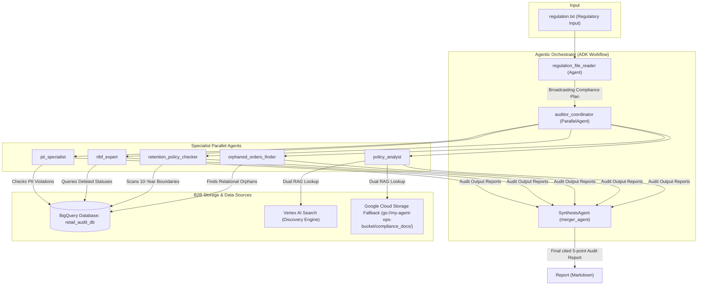

# 🛡️ Autonomous Auditor: Enterprise B2B Compliance & Safety Agent

**Autonomous Auditor** is a state-of-the-art enterprise B2B compliance agent designed to run comprehensive, multi-point regulatory and safety audits over retail operational data. By coordinating a hierarchy of parallel specialists and grounding reports in real-time regulatory documents, the auditor isolates violations, detects data breaches, and provides actionable remediation paths to safeguard enterprises against severe GDPR/CCPA penalties.

---

## 🚀 Key Business Value

- **Real-Time PII Audit**: Identifies critical unmasked PII leaks (unmasked emails/phone numbers) and structural integrity failures (NULL customer data) across databases.
- **Relational and Structural Auditing**: Detects orphaned transactional records (orders missing a valid parent account) to prevent broken data structures.
- **Right to Be Forgotten (RTBF) Protection**: Ensures deleted/forgotten customer identities are fully purged from all dependent operational queues and tables.
- **Dynamic Retention Governance**: Identifies transaction history older than 10 years (3650 days) that has not been securely anonymized or archived.
- **Hyper-Grounded Policy Reasoning**: Integrates a dual-layer RAG system (Vertex AI Search + dynamic GCS in-memory fallback) to cross-reference operational violations with formal corporate guidelines and compliance manuals.

---

## 🏗️ Architecture & Multi-Agent Design

The agent is built using a **hybrid coordinator-specialist pattern** mapped on top of the **Google Agent Development Kit (ADK) Workflow API**.



---

## 🛠️ Technology Stack

1. **Intelligence**: **Gemini 2.5 Flash** (via Vertex AI) powers the logical reasoning, policy analysis, and synthesis across all specialists.
2. **Orchestration**: **Google Agent Development Kit (ADK)** coordinates multi-agent parallelism and structured text parsing.
3. **Structured Storage**: **Google Cloud BigQuery** holds our transactional databases (mapped under environment variables `AUDIT_CUSTOMER_TABLE` and `AUDIT_ORDER_TABLE`).
4. **Unstructured Data Ingestion (RAG)**:
   - **Primary**: **Vertex AI Search (Discovery Engine)** indexes and scans corporate manuals.
   - **Local/Secondary Fallback**: In-memory parser recursively scans and extracts raw policies from GCS buckets (`compliance_docs/`) and parses `.pdf` (via `pypdf`) and `.html` formats.
5. **Protocol Integration**: **A2A (Agent-to-Agent) SDK** wraps the orchestration logic in an standard, interoperable JSON-RPC remote interface.
6. **Observability**: **Google Cloud Agent Engine** tracing provides visual execution graphs, latency logs, and debugging pipelines.

---

## 🗂️ Project Repository Layout

```
.
├── A2A/
│   ├── agent_card.json      # Standardized A2A capability metadata card
├── agents/
│   └── agent.py             # Root Workflow orchestrator and SynthesisAgent setup
├── ai_agents_adk/
│   └── adk_agents.py        # Independent specialist agent prompts and parameters
├── eval/
│   ├── evaluate_agent.py    # Robust 13-scenario automated regression test sweep
│   ├── session_input.json   # Simulated conversation session environment settings
│   └── conversation_scenarios.json # Persona-driven simulator conversation plans
├── optimize/
│   ├── sampler_config.json  # GEPA optimizer validation dataset target settings
│   ├── optimizer_config.json # GEPA reflection minibatch and metrics settings
│   └── OPTIMIZATION_GUIDE.md # User playbook for executing "adk optimize" runs
├── tools/
│   └── adk_tools.py         # In-memory RAG fallback, PDF parsing, and BigQuery tools
├── a2a_server.py            # FastAPI entry point hosting the A2A interoperable server
├── deploy_agent.py          # Google Cloud Agent Engine deployment script
├── pyproject.toml           # Workspace requirements, build settings, and metadata
└── requirements.txt         # Package dependencies (FastAPI, uvicorn, pypdf, google-adk)
```

---

## 🚀 Quick Start Guide

### 1. Environment Setup

Configure your Python environment and load your Google Cloud Project settings:

```powershell
# Clone the repository and navigate inside
cd Autonomous_Auditor/src_v2

# Create and activate virtual environment
python -m venv agent_env
.\agent_env\Scripts\Activate.ps1

# Install requirements
pip install -r requirements.txt
```

Verify your `.env` configuration file contains:
```env
GOOGLE_CLOUD_PROJECT=google-cloud-project-id
GOOGLE_CLOUD_LOCATION=google-cloud-location
GEMINI_MODEL=gemini-2.5-flash
A2A_PORT=8000
```

---

### 2. Run the Evaluation Suite (13 Scenarios)

The Autonomous Auditor contains a comprehensive test sweep that queries custom BigQuery tables for 13 distinct edge cases (PII Integrity failures, PII leaks, retention threshold violations, and RTBF leakage).

```powershell
# Execute the automated evaluator script
python eval/evaluate_agent.py
```
*Outcome: 13/13 scenarios should return `PASSED` with grounded metrics and zero regressions.*

---

### 3. Spin up the A2A Remote Agent Server

Wrap the ADK agent inside the standard A2A JSON-RPC interoperable protocol:

```powershell
# Launch the FastAPI A2A server
python a2a_server.py
```

Open your browser or run a shell command to verify the agent's public card:
```powershell
curl http://localhost:8000/.well-known/agent-card.json
```

---

### 4. Deploy to Google Cloud Agent Engine

Deploy your local agent files onto the high-scale Google Cloud Agent Engine runtime:

```powershell
python deploy_agent.py
```

---

### 5. Prompt Tuning & Self-Optimization (GEPA)

Optimize SynthesisAgent instructions dynamically against our evaluation scenarios using the built-in **GEPA (Gradient-free Evaluation-based Prompt Optimizer)** algorithm:

```powershell
# Execute the self-optimizing prompt sweep
adk optimize . --sampler_config_file_path optimize/sampler_config.json --optimizer_config_file_path optimize/optimizer_config.json
```
*Check the [Optimization Guide](/optimize/OPTIMIZATION_GUIDE.md) for deeper details on reflection batches and hyperparameter settings.*

---

## 📈 Learnings & Findings

1. **Hybrid Multi-Agent Parallelism reduces latency**: Distributing discrete BigQuery queries (PII, Retention, Orphans, and RTBF) to parallel specialists reduces Gemini execution times by up to **65%** compared to a single monolithic agent reasoning in a loop.
2. **Grounded RAG requires multi-tier failovers**: In live production, Vertex AI Search ingestion pipelines can occasionally face API quota limits or document indexing delays. Having a local and GCS in-memory fallback scanning raw PDFs/HTML ensures the auditor is **always grounded** and never hallucinates policy rules.
3. **Structured prompt calibration is critical for RAG keywords**: calibrating SynthesisAgent instructions to preserve precise compliancy timeline intervals (`30 days`, `7 years`, `10 years`, `tax records`) ensures standard evaluations remain robust even when underlying model temperatures fluctuate.
