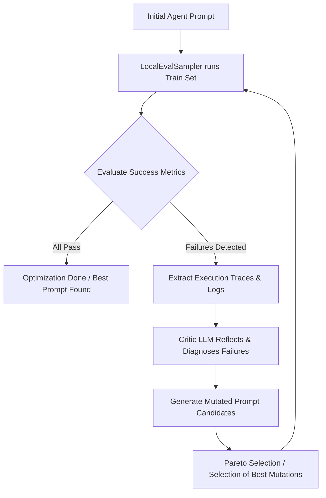

# Autonomous Auditor Agent Optimization User Guide (GEPA)

This guide explains how to automatically refine the system instructions of the **Autonomous Auditor** agent using the **Agent Development Kit (ADK)** and the **Agent Optimizer (GEPA)**.

---

## 1. Overview of ADK Optimization & GEPA

Manual prompt engineering is notoriously hard to scale. Minor changes in instructions can improve one scenario while breaking others. The `adk optimize` command solves this by treating prompt refinement as a systematic, automated optimization problem.

### Key Concepts:
* **Genetic-Pareto (GEPA) Algorithm**: GEPA is a reflective, evolutionary optimization algorithm. Rather than relying on simple scalar rewards, GEPA uses **Natural Language Reflection**:
  1. It analyzes agent **execution traces** (reasoning chains, tool calls, results, and error logs) for failed scenarios.
  2. A "critic" LLM diagnoses the failure reasons and proposes logical prompt modifications.
  3. It generates candidate instructions, tests them over multiple generations, and uses Pareto-aware selection to find prompts that maximize performance across all audit metrics without regression.
* **LocalEvalSampler**: The sampler evaluates candidate prompts against the specified training dataset (`set_with_conversation_scenarios`), runs them locally, and aggregates metric results.

---

## 2. Configuration Setup

The optimization framework is located in the [optimize/] directory.

### A. Sampler Configuration: `optimize/sampler_config.json`
Controls how candidates are evaluated, which metrics define success, and which datasets to use:

```json
{
  "eval_config": {
    "criteria": {
      "tool_trajectory_avg_score": 1.0,
      "response_match_score": 0.8
    }
  },
  "app_name": "src_v2",
  "train_eval_set": "set_with_conversation_scenarios",
  "validation_eval_set": "set_with_conversation_scenarios"
}
```

* **`criteria`**: Defines the success thresholds:
  * `tool_trajectory_avg_score`: `1.0` (requires 100% correct specialist tool invocations).
  * `response_match_score`: `0.8` (requires the synthesized summary report to strongly align with golden references).
* **`app_name`**: Must match the folder name of the agent module, which is `"src_v2"` (since the workspace root acts as the entrypoint).
* **`train_eval_set` & `validation_eval_set`**: Point to `"set_with_conversation_scenarios"`, which contains diverse customer databases, RTBF violations, orphaned records, and PII leaks.

### B. Optimizer Configuration: `optimize/optimizer_config.json`
Configures the GEPA optimization algorithm hyperparameters:

```json
{
  "optimizer_model": "gemini-2.5-flash",
  "max_metric_calls": 20,
  "reflection_minibatch_size": 3,
  "run_dir": "optimize/runs"
}
```

* **`optimizer_model`**: The model used to analyze traces and write prompt mutations (defaults to `"gemini-2.5-flash"`).
* **`max_metric_calls`**: The upper limit of evaluation runs (budgeting) allowed across candidates.
* **`reflection_minibatch_size`**: The number of failure examples the critic reviews at once to formulate prompt improvements.
* **`run_dir`**: The folder where intermediate generations, candidate prompts, and detailed metrics are stored.

---

## 3. Running the Optimizer

### Prerequisites
Before running, make sure the `gepa` python package is installed in your environment (it is a lazy import in ADK).

1. Activate your virtual environment:
   ```powershell
   .\venv\Scripts\Activate.ps1
   ```
2. Ensure GCS credentials and environment variables are loaded (e.g. `GOOGLE_CLOUD_PROJECT`).
3. Run the optimization command from the workspace root directory:
   ```powershell
   adk optimize . --sampler_config_file_path=optimize/sampler_config.json --optimizer_config_file_path=optimize/optimizer_config.json --print_detailed_results
   ```

*Note: The `.` refers to the workspace root directory, which contains the root [agent.py] entrypoint.*

---

## 4. How the Optimization Process Works



1. **Evaluation Phase**: The initial prompt is run against the scenarios in `set_with_conversation_scenarios.evalset.json`.
2. **Reflection Phase**: For any mismatched violations (e.g., incorrect PII leak identification or skipped orphaned records), GEPA extracts the exact reasoning traces, tool queries, and final reports.
3. **Mutation Phase**: The reflection LLM diagnoses *why* the prompt failed (e.g. *"specialist agents did not receive clear instructions to execute immediately without asking for confirmation"*), and generates 3-5 mutated versions of the system instructions.
4. **Pareto Selection**: Candidates are evaluated. Candidates that improve one metric while degrading another are kept as part of the "Pareto front". The best performing, most robust instruction set is selected.
5. **Output**: Once the `max_metric_calls` or convergence is reached, the CLI outputs the finalized, refined agent instructions.

---

## 5. Reviewing the Results

All optimization logs are persisted inside [optimize/runs/] folder. For each optimization loop, you can examine:
- `candidates.json`: The historical prompt instruction sets tested.
- `traces.json`: Traces containing intermediate reasoning chains and tool results of failure scenarios.
- `aggregate_scores.json`: Success scores across metrics for each generation, allowing you to trace the prompt's evolution.
